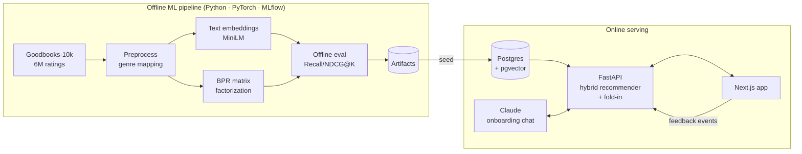

# 📚 Alexandria - personalized book recommendations that learn as you read

Alexandria is a full-stack, end-to-end recommender system. New readers describe their taste
(through a quick genre/book picker **or** a conversation with an LLM librarian), get a tailored
shelf immediately, and every ♥ / 👍 / 👎 they give re-tunes their recommendations in real time -
no retraining required.



## Why it's interesting

| Problem | How Alexandria handles it |
|---|---|
| **Cold start** - a new user has no history | Content embeddings + genre "anchor" vectors give good picks from just a few genres/books. |
| **Real-time personalization** | Instead of retraining, each request *folds in* a user vector from their feedback against the learned item factors (closed-form weighted ridge regression, <1 ms). |
| **Balancing signals** | Collaborative-filtering weight grows with the amount of feedback (`w_cf = 0.8·n/(n+2)`, tuned on a validation split), shifting from content-based to CF as the model learns you. |
| **Filter bubbles** | MMR re-ranking for diversity, plus "explore" slots sampled from further down the ranking. |
| **Trust** | Every recommendation carries a reason: *"Because you enjoyed Mistborn"*, *"Readers who loved Dune also loved this"*. |
| **Train/serve skew** | The ranking logic lives in one numpy package (`core/`) used by *both* offline evaluation and the API - what's benchmarked is what's served. |
| **Future retraining** | An append-only `events` table logs impressions (with position, reason, model version) and feedback for CTR analysis and retraining. |

## Tech stack

| Layer | Tools |
|---|---|
| ML / data | Python, **PyTorch** (BPR-MF), **sentence-transformers**, scikit-learn, pandas, NumPy, **MLflow** experiment tracking |
| Backend | **FastAPI**, Pydantic v2, **SQLAlchemy 2.0**, **PostgreSQL + pgvector** (HNSW index), JWT auth, bcrypt |
| LLM | **Anthropic Claude API** - structured outputs for preference extraction |
| Frontend | **Next.js 16** (App Router), **React 19**, **TypeScript**, **Tailwind CSS v4** |
| Infra / MLOps | **Docker** & Docker Compose, **GitHub Actions** CI (lint, tests, Postgres integration test, image builds), Render / Vercel / Neon deploy |
| Quality | pytest (unit + API + pipeline tests), Ruff, ESLint, `tsc` |

## Repository layout

```
core/   alexandria_core   numpy-only recommender: hybrid scoring, fold-in, MMR, metrics
ml/     alexandria_ml     data download → preprocessing → embeddings → BPR training → evaluation → artifacts
api/    app              FastAPI service: auth, catalog, feedback, recommendations, LLM onboarding chat
web/                     Next.js frontend
docs/                    ROADMAP.md · ARCHITECTURE.md · DEPLOYMENT.md
```

## Quickstart (local)

**Prerequisites:** Python 3.11+, Node 20+, Docker (optional, for Postgres).

```bash
# 1. Python environment
python -m venv .venv && source .venv/bin/activate      # Windows: .venv\Scripts\activate
pip install torch --index-url https://download.pytorch.org/whl/cpu
pip install -e ./core -e "./ml[dev,tracking,sbert]" -e "./api[dev]"

# 2. Train (real data: downloads ~70MB Goodbooks-10k; add --synthetic for a 10-second demo run)
cd ml && python -m alexandria_ml.pipeline && cd ..

# 3. Database + seed
docker compose up -d db                                  # or set DATABASE_URL=sqlite:///./alexandria-dev.db in api/.env
cp api/.env.example api/.env                             # add ANTHROPIC_API_KEY to enable the chat librarian
cd api && python -m app.seed && uvicorn app.main:app --reload && cd ..   # API docs: http://localhost:8000/docs

# 4. Frontend
cd web && cp .env.example .env.local && npm install && npm run dev       # http://localhost:3000
```

Or run everything in containers: `docker compose up --build`, then
`docker compose run --rm api python -m app.seed --artifacts /artifacts`.

Inspect experiments with `mlflow ui --backend-store-uri sqlite:///ml/mlflow.db`.

## Offline evaluation

Goodbooks-10k: 10,000 books · 53,424 users · 5.98M ratings. For each user with ≥5 positive ratings
(≥4★), 20% of positives are held out; every model ranks the full catalog minus the user's training
books. Metrics averaged over 2,000 test users. Serving hyper-parameters were tuned on a separate
validation split (`python -m alexandria_ml.tune`), never on the test set.

| Model | Recall@20 | NDCG@20 | Hit rate@20 | Coverage@20 |
|---|---|---|---|---|
| Popularity baseline | 0.083 | 0.089 | 59.4% | 0.6% |
| Content only (MiniLM embeddings) | 0.030 | 0.026 | 27.0% | 14.5% |
| BPR-MF (learned user vectors) | 0.181 | 0.183 | 86.6% | 64.6% |
| **Hybrid + fold-in, as served** (MMR + author cap) | **0.216** | **0.242** | **90.2%** | **53.3%** |
| Hybrid, cold start (only 5 ratings known) | 0.117 | 0.135 | 71.3% | 63.0% |

- The served hybrid beats BPR by **+32% NDCG@20** without a learned per-user embedding - new
  feedback changes recommendations instantly - and beats popularity **2.7×**.
- With only 5 ratings it already beats the popularity baseline by **52%** NDCG@20.
- Tuning mattered: the first real-data run scored 0.112 NDCG@20 with 1.9% coverage because BPR's
  item bias (a hidden popularity term) dominated every user's list. See
  [ARCHITECTURE.md → Hyper-parameter tuning](docs/ARCHITECTURE.md#hyper-parameter-tuning).
- Weak spot: the content model (Goodbooks has no book descriptions) - addressed in roadmap Phase 10.

## Roadmap

The project is built in phases - see [docs/ROADMAP.md](docs/ROADMAP.md). Design details and
the model card are in [docs/ARCHITECTURE.md](docs/ARCHITECTURE.md); hosting steps in
[docs/DEPLOYMENT.md](docs/DEPLOYMENT.md).

## Data & license

Book metadata and ratings: [Goodbooks-10k](https://github.com/zygmuntz/goodbooks-10k) (CC BY-SA 4.0).
