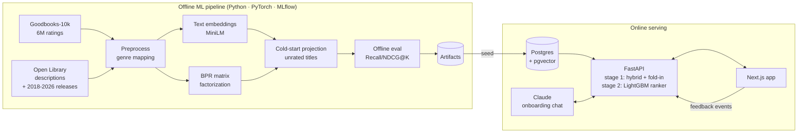

# 📚 Alexandria - personalized book recommendations that learn as you read

[](https://github.com/basharfkhan/alexandria/actions/workflows/ci.yml)

**[🔗 Live demo](https://alexandria-ashy.vercel.app)** · **[API docs (Swagger)](https://alexandria-api-xsyl.onrender.com/docs)** · **[Portfolio](https://basharkhan.dev)**

> The API runs on Render's free tier and sleeps when idle - the first request after a quiet period
> can take ~30-50 s while it wakes up.


Alexandria is a full-stack, end-to-end recommender system. New readers describe their taste
(through a quick genre/book picker **or** a conversation with an LLM librarian), get a tailored
shelf immediately, and every ♥ / 👍 / 👎 they give re-tunes their recommendations in real time -
no retraining required.

**Headline result (6M Goodreads ratings):** two-stage ranking reaches NDCG@20 **0.309** -
**+70%** over matrix factorization and **3.5×** a popularity baseline - while personalizing instantly
from new feedback, with no retraining. The catalog is 12,220 books, including 2,220 published after
the ratings data ends in 2017, which are recommended without ever having been rated.
[Details ↓](#offline-evaluation)

| Deployment | |
|---|---|
| Web (Next.js) | [Vercel](https://alexandria-ashy.vercel.app) |
| API (FastAPI, Docker) | [Render](https://alexandria-api-xsyl.onrender.com/docs) |
| Database (Postgres + pgvector) | Neon |



## Why it's interesting

| Problem | How Alexandria handles it |
|---|---|
| **Cold start** - a new user has no history | Content embeddings + genre "anchor" vectors give good picks from just a few genres/books. |
| **Ranking** | Two stages: the hybrid blend retrieves 200 candidates, then a LightGBM LambdaMART model reorders them (+29% NDCG@20). |
| **Real-time personalization** | Instead of retraining, each request *folds in* a user vector from their feedback against the learned item factors (closed-form weighted ridge regression, <1 ms). |
| **Balancing signals** | Collaborative-filtering weight grows with the amount of feedback (`w_cf = 0.8·n/(n+2)`, tuned on a validation split), shifting from content-based to CF as the model learns you. |
| **New releases** - the ratings stop in 2017 | 2,220 titles published since are projected into the collaborative space from their nearest rated neighbours, then served in reserved slots (2 per page) so a fresher catalog cannot cost ranking quality. |
| **Filter bubbles** | MMR re-ranking for diversity, plus "explore" slots sampled from further down the ranking. |
| **Trust** | Every recommendation carries a reason: *"Because you enjoyed Mistborn"*, *"Readers who loved Dune also loved this"*. |
| **Train/serve skew** | The ranking logic lives in one numpy package (`core/`) used by *both* offline evaluation and the API - what's benchmarked is what's served. |
| **Retraining safely** | A weekly GitHub Action retrains, compares against the live model on four gate metrics, and **only promotes when nothing regresses**; the API hot-reloads the new model without a redeploy. |
| **Closing the loop** | Ratings collected in the app are folded back into training as extra users; an append-only `events` table logs impressions (position, reason, model version) for click-through analysis. |

## Tech stack

| Layer | Tools |
|---|---|
| ML / data | Python, **PyTorch** (BPR-MF), **LightGBM** (LambdaMART re-ranker), **sentence-transformers**, scikit-learn, pandas, NumPy, **MLflow** experiment tracking |
| Backend | **FastAPI**, Pydantic v2, **SQLAlchemy 2.0**, **PostgreSQL + pgvector** (HNSW index), JWT auth, bcrypt |
| LLM | **Anthropic Claude API** - structured outputs for preference extraction |
| Frontend | **Next.js 16** (App Router), **React 19**, **TypeScript**, **Tailwind CSS v4** |
| Infra / MLOps | **Docker** & Docker Compose, **GitHub Actions** CI + scheduled retraining with a model registry and promotion gate, Render / Vercel / Neon deploy |
| Quality | pytest (unit + API + pipeline tests), Ruff, ESLint, `tsc` |

## Repository layout

```
core/   alexandria_core   numpy-only recommender: hybrid scoring, fold-in, MMR, metrics
ml/     alexandria_ml     data download → preprocessing → embeddings → BPR training → evaluation → artifacts
api/    app              FastAPI service: auth, catalog, feedback, recommendations, LLM onboarding chat
web/                     Next.js frontend
docs/                    ROADMAP.md · ARCHITECTURE.md · DEPLOYMENT.md
```

## Quickstart (local)

**Prerequisites:** Python 3.11+, Node 20+, Docker (optional, for Postgres).

```bash
# 1. Python environment
python -m venv .venv && source .venv/bin/activate      # Windows: .venv\Scripts\activate
pip install torch --index-url https://download.pytorch.org/whl/cpu
pip install -e ./core -e "./ml[dev,tracking,sbert]" -e "./api[dev]"

# 2. Train (real data: downloads ~70MB Goodbooks-10k; add --synthetic for a 10-second demo run)
cd ml
python -m alexandria_ml.data.openlibrary     # optional: book descriptions + covers (~1 h, resumable)
python -m alexandria_ml.pipeline && cd ..    # post-2017 titles ship in ml/enrichment (--no-recent-books to skip)

# 3. Database + seed
docker compose up -d db                                  # or set DATABASE_URL=sqlite:///./alexandria-dev.db in api/.env
cp api/.env.example api/.env                             # add ANTHROPIC_API_KEY to enable the chat librarian
cd api && python -m app.seed && uvicorn app.main:app --reload && cd ..   # API docs: http://localhost:8000/docs

# 4. Frontend
cd web && cp .env.example .env.local && npm install && npm run dev       # http://localhost:3000
```

Or run everything in containers: `docker compose up --build`, then
`docker compose run --rm api python -m app.seed --artifacts /artifacts`.

Inspect experiments with `mlflow ui --backend-store-uri sqlite:///ml/mlflow.db`.

## Offline evaluation

Goodbooks-10k: 10,000 books · 53,424 users · 5.98M ratings, plus 2,220 titles published 2018-2026
that carry no ratings. For each user with ≥5 positive ratings (≥4★), 20% of positives are held out;
every model ranks the full catalog minus the user's training books. Metrics averaged over 2,000 test
users. Serving hyper-parameters were tuned on a separate validation split
(`python -m alexandria_ml.tune`), never on the test set.

| Model | Recall@20 | NDCG@20 | Hit rate@20 | Coverage@20 |
|---|---|---|---|---|
| Popularity baseline | 0.083 | 0.089 | 59.4% | 0.5% |
| Content only (MiniLM embeddings) | 0.024 | 0.022 | 21.6% | 13.3% |
| BPR-MF (learned user vectors) | 0.180 | 0.182 | 86.8% | 51.8% |
| Stage 1 only: hybrid + fold-in (MMR + author cap) | 0.203 | 0.225 | 89.7% | 42.1% |
| **Stage 1 + LightGBM re-ranker, rated catalog** | **0.279** | **0.309** | **94.6%** | **44.3%** |
| The same model exactly as served, with 2 new-release slots per page | 0.265 | 0.290 | 93.9% | 37.8% |
| Two-stage, cold start (only 5 ratings known) | 0.142 | 0.160 | 77.7% | 41.5% |

- Two-stage ranking beats BPR by **+70% NDCG@20** without a learned per-user embedding - new
  feedback changes recommendations instantly - and beats popularity **3.5×**.
- The second stage adds **+29%** over the tuned hybrid alone; with only 5 ratings known it still
  beats the popularity baseline by **80%**.
- The served row scores lower by construction, not by regression: two of twenty slots go to books
  published after 2017, which the held-out 2017 ratings can never reward. The bolded row is the
  like-for-like measurement, and it is what the promotion gate reads. Coverage for that row is
  measured against the 10,000 rated books it ranks; every other row is measured against all 12,220.
- The ranker costs catalog coverage: a model trained on "what will they rate next" drifts towards
  popular books. Anchoring it to the first-stage score keeps ~75% of the gain and restores on-topic
  lists - see
  [ARCHITECTURE.md → Second-stage ranker](docs/ARCHITECTURE.md#second-stage-ranker-learning-to-rank).
- Adding unrated books cost about 1% NDCG@20, inside the gate's 2% tolerance. A control run (old
  catalog, current code) reproduced the live model to four decimals, which is how the drop was
  attributed to the catalog rather than to retraining noise.
- Tuning mattered: the first real-data run scored 0.112 NDCG@20 with 1.9% coverage because BPR's
  item bias (a hidden popularity term) dominated every user's list. See
  [ARCHITECTURE.md → Hyper-parameter tuning](docs/ARCHITECTURE.md#hyper-parameter-tuning).
- Book descriptions (9,539 of 12,220, from Open Library) made "similar books" far more topical -
  *The Martian* → *Red Mars*, *Packing for Mars* instead of *The Humans* - but did **not** move
  ranking accuracy, which is driven by collaborative signals. Embeddings are therefore a 50/50 blend
  of metadata and description views, chosen on the validation split. See
  [ARCHITECTURE.md → Book descriptions](docs/ARCHITECTURE.md#book-descriptions-open-library).

## Retraining

```bash
cd ml
python -m alexandria_ml.pipeline --app-feedback   # train on Goodbooks + ratings from the live app
python -m alexandria_ml.promote --artifacts artifacts   # gate: exit 0 = promote, 1 = regression
python ../docs/media/results_chart.py                   # redraw the results chart from the manifest
```

`.github/workflows/retrain.yml` runs this weekly: train → evaluate → compare against the live
model in `ml/model_registry.json` → seed the database only when promoted (the API hot-reloads
within a minute). A rejected model is still recorded, and the run fails loudly.

Without production traffic yet, `python -m alexandria_ml.simulate_traffic --readers 20` replays
real Goodbooks readers through the API - they onboard with books they loved and answer
recommendations the way they rated those books historically - so the loop has honest data to
learn from. Details: [ARCHITECTURE.md → Retraining loop](docs/ARCHITECTURE.md#retraining-loop-and-promotion-gate).

## Roadmap

The project is built in phases - see [docs/ROADMAP.md](docs/ROADMAP.md). Design details and
the model card are in [docs/ARCHITECTURE.md](docs/ARCHITECTURE.md); hosting steps in
[docs/DEPLOYMENT.md](docs/DEPLOYMENT.md).

## Data & license

Book metadata and ratings: [Goodbooks-10k](https://github.com/zygmuntz/goodbooks-10k) (CC BY-SA 4.0).
Book descriptions, subjects, covers and post-2017 titles:
[Open Library](https://openlibrary.org/developers/licensing) (CC0).
