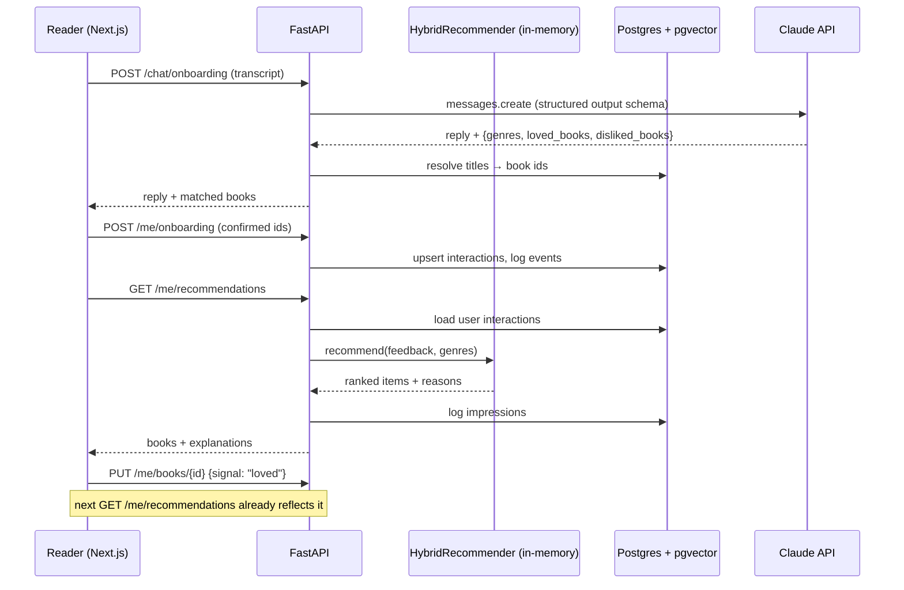

# Architecture & model card

## System overview

### Offline → online hand-off

`python -m alexandria_ml.pipeline` writes `ml/artifacts/`:

| File | Contents |
|---|---|
| `books.json` | catalog metadata (title, authors, genres, tags, covers) |
| `content_embeddings.npy` | `(n_books, 384)` L2-normalised MiniLM embeddings |
| `cf_factors.npy`, `cf_bias.npy` | `(n_books, 64)` BPR item factors + item bias |
| `manifest.json` | model version, hyper-parameters, evaluation metrics |

`python -m app.seed` loads these into Postgres (`vector(384)` / `vector(64)` columns + HNSW index).
On startup the API reads the vectors into an in-memory `HybridRecommender`.

**Why in-memory scoring *and* pgvector?** At 10k books, brute-force numpy over the whole
catalog takes a few ms and makes blending many signals trivial. pgvector remains the source
of truth and serves nearest-neighbour queries (`/books/{id}/similar`). At millions of items
the candidate-generation step would move to the ANN index (retrieve ~500 by content and CF
vectors), with the same blending applied to candidates only.

## Recommendation algorithm

For a user with feedback `F = {book: weight}` (loved +2, liked +1, want-to-read +0.5,
disliked −1, not-interested −0.5) and chosen genres `G`:

1. **Content profile** - weighted mean of liked-book embeddings, minus ½ × weighted mean of
   disliked ones, plus genre anchors (mean embedding of each genre's 50 most popular books).
   `content_i = cos(profile, e_i)`.
2. **Collaborative signal** - fold in a user vector `u` against fixed item factors `Y`:

   `u = (YᵀY + Yᵢᵀ(Cᵢ − I)Yᵢ + λI)⁻¹ Yᵢᵀ Cᵢ pᵢ`,  with confidence `c = 1 + α|w|` (α = 5, λ = 1),
   target `p = +1` for positive feedback and `p = −1` for dislikes.
   `cf_i = u·y_i`. `YᵀY` is precomputed, so each solve is `O(f³)` with `f = 64`.
3. **Blend** z-scored signals:

   `score = (1 − w_cf)·z(content) + w_cf·z(cf) + 0.6·genre_match + 0.3·z(log popularity) + 0.1·z(avg rating)`

   with `w_cf = 0.8 · n / (n + 2)` where `n` = number of explicit ratings.
4. **Filter** books already on the user's shelf.
5. **Re-rank** the top 200 with MMR (λ = 0.75) for diversity, then insert ~1 exploration
   pick per 8 slots, sampled from lower in the ranking.
6. **Explain** - the reason is the dominant signal; the "because of" book is the liked book
   whose embedding is closest to the recommendation.

## Evaluation protocol

- Positive = rating ≥ 4. For users with ≥ 5 positives, 20% are held out (random, seeded -
  Goodbooks has no timestamps, so a temporal split isn't possible).
- Each model ranks all books except the user's training items; metrics over 2,000 sampled users.
- `hybrid_foldin` evaluates the *serving* path: no learned user embedding, only fold-in from
  the user's training ratings. `hybrid_cold5` repeats this with just 5 random ratings to
  simulate a newly onboarded reader.
- Coverage@K is reported alongside accuracy so a model can't win by recommending the same
  bestsellers to everyone.

## Data model

| Table | Purpose |
|---|---|
| `users` | credentials (bcrypt), favorite genres, onboarding flag |
| `books` | catalog + `content_embedding vector(384)`, `cf_factors vector(64)`, `cf_bias` |
| `interactions` | current signal per (user, book) - what the recommender reads |
| `events` | append-only impressions (position, reason, model version) and feedback - for analytics & retraining |
| `model_meta` | manifest of the currently seeded model |

## LLM onboarding design

- One stateless Messages API call per turn; the client holds the transcript.
- Structured outputs (`output_config.format` JSON schema, genre slugs as an `enum`) guarantee
  parseable, catalog-valid preferences - no regex over free text.
- `effort: "low"` keeps latency conversational; server-side refusal fallback is enabled.
- The LLM never recommends books itself - it only extracts preferences. Recommendations
  always come from the evaluated model, and extracted books are confirmed by the user.
- Errors map to HTTP 503 with a friendly message; the quiz path doesn't depend on the LLM.

## Hyper-parameter tuning

`python -m alexandria_ml.tune` searches the serving-path settings on a **validation** split carved
out of the training data (the test split is never used for tuning). The objective is the mean of
NDCG@20 with full history and NDCG@20 with only 5 ratings, so cold-start quality counts as much as
heavy-user quality. Results are saved to `ml/tuning/` and logged to MLflow.

What the first real-data run found:

- **BPR's item bias must be excluded from the fold-in score.** The learned bias is essentially a
  popularity score; with it, every user got nearly the same list (coverage@20 ≈ 2%) and NDCG@20 on
  the validation split was 0.110. Without it: 0.174 and 42% coverage.
- **The global Gram term (`YᵀY`) matters.** Solving only over rated items overfits heavy users
  (full-history NDCG@20 as low as 0.034).
- λ barely matters; α = 5 beat α = 20; letting CF take over faster (`0.8·n/(n+2)`) helped cold start.
- **Popularity weight is a product decision, not just a metric.** 0.5 scored highest (objective
  0.155) but covered 27% of the catalog; 0.3 kept most of the gain (0.150) at 39% coverage.

These results came from a bug that synthetic tests could not catch: the old defaults matched BPR on
toy data but lost ~40% of its accuracy at real scale.

## Known limitations

- Goodbooks-10k has no book descriptions; embeddings rely on titles, authors and shelf tags.
- The catalog is fixed at 10k popular books, so niche titles can't be matched.
- Popularity bias in the ratings data; mitigated (not solved) by MMR and exploration.
- Fold-in uses BPR-trained factors with an ALS-style objective - an approximation. It still trails
  BPR's learned user vectors for heavy users; an ALS-trained model would make fold-in exact.
