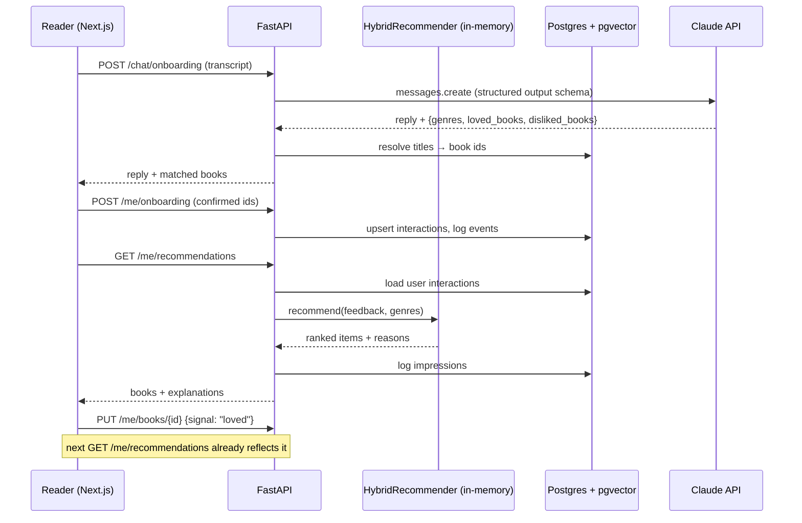
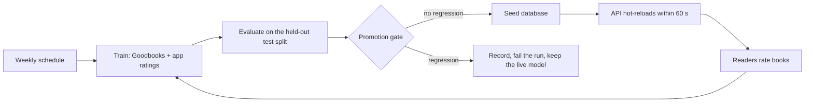

# Architecture & model card

## System overview

### Offline → online hand-off

`python -m alexandria_ml.pipeline` writes `ml/artifacts/`:

| File | Contents |
|---|---|
| `books.json` | catalog metadata (title, authors, genres, tags, covers) |
| `content_embeddings.npy` | `(n_books, 384)` L2-normalised MiniLM embeddings |
| `cf_factors.npy`, `cf_bias.npy` | `(n_books, 64)` BPR item factors + item bias |
| `manifest.json` | model version, hyper-parameters, evaluation metrics |

`python -m app.seed` loads these into Postgres (`vector(384)` / `vector(64)` columns + HNSW index).
On startup the API reads the vectors into an in-memory `HybridRecommender`.

**Why in-memory scoring *and* pgvector?** At 10k books, brute-force numpy over the whole
catalog takes a few ms and makes blending many signals trivial. pgvector remains the source
of truth and serves nearest-neighbour queries (`/books/{id}/similar`). At millions of items
the candidate-generation step would move to the ANN index (retrieve ~500 by content and CF
vectors), with the same blending applied to candidates only.

## Recommendation algorithm

For a user with feedback `F = {book: weight}` (loved +2, liked +1, want-to-read +0.5,
disliked −1, not-interested −0.5) and chosen genres `G`:

1. **Content profile** - weighted mean of liked-book embeddings, minus ½ × weighted mean of
   disliked ones, plus genre anchors (mean embedding of each genre's 50 most popular books).
   `content_i = cos(profile, e_i)`.
2. **Collaborative signal** - fold in a user vector `u` against fixed item factors `Y`:

   `u = (YᵀY + Yᵢᵀ(Cᵢ − I)Yᵢ + λI)⁻¹ Yᵢᵀ Cᵢ pᵢ`,  with confidence `c = 1 + α|w|` (α = 5, λ = 1),
   target `p = +1` for positive feedback and `p = −1` for dislikes.
   `cf_i = u·y_i`. `YᵀY` is precomputed, so each solve is `O(f³)` with `f = 64`.
3. **Blend** z-scored signals:

   `score = (1 − w_cf)·z(content) + w_cf·z(cf) + 0.6·genre_match + 0.3·z(log popularity) + 0.1·z(avg rating)`

   with `w_cf = 0.8 · n / (n + 2)` where `n` = number of explicit ratings.
4. **Filter** books already on the user's shelf.
5. **Re-rank** the 200 candidates with the learned second-stage model (see below), then apply
   MMR (λ = 0.75) for diversity and insert ~1 exploration pick per 8 slots.
6. **Explain** - the reason is the dominant signal; the "because of" book is the liked book
   whose embedding is closest to the recommendation.

## Evaluation protocol

- Positive = rating ≥ 4. For users with ≥ 5 positives, 20% are held out (random, seeded -
  Goodbooks has no timestamps, so a temporal split isn't possible).
- Each model ranks all books except the user's training items; metrics over 2,000 sampled users.
- `hybrid_foldin` evaluates the *serving* path: no learned user embedding, only fold-in from
  the user's training ratings. `hybrid_cold5` repeats this with just 5 random ratings to
  simulate a newly onboarded reader.
- Coverage@K is reported alongside accuracy so a model can't win by recommending the same
  bestsellers to everyone.

## Data model

| Table | Purpose |
|---|---|
| `users` | credentials (bcrypt), favorite genres, onboarding flag |
| `books` | catalog + Open Library `description`, `content_embedding vector(384)`, `cf_factors vector(64)`, `cf_bias` |
| `interactions` | current signal per (user, book) - what the recommender reads |
| `events` | append-only impressions (position, reason, model version) and feedback - for analytics & retraining |
| `chat_usage` | one row per LLM chat turn - backs the spend limits |
| `model_blobs` | binary model artifacts served with the catalog (the LightGBM ranker) |
| `model_meta` | manifest of the currently seeded model |

## LLM onboarding design

- One stateless Messages API call per turn; the client holds the transcript.
- Structured outputs (`output_config.format` JSON schema, genre slugs as an `enum`) guarantee
  parseable, catalog-valid preferences - no regex over free text.
- `effort: "low"` keeps latency conversational; server-side refusal fallback is enabled.
- The LLM never recommends books itself - it only extracts preferences. Recommendations
  always come from the evaluated model, and extracted books are confirmed by the user.
- Errors map to HTTP 503 with a friendly message; the quiz path doesn't depend on the LLM.
- Spend guards: each turn is recorded in `chat_usage` *before* the LLM call; per-user (hour/day)
  and global daily caps are counted in Postgres so they survive the free instance sleeping, and a
  per-IP in-memory window blunts one client creating many accounts. Over-limit requests get HTTP 429.

## Hyper-parameter tuning

`python -m alexandria_ml.tune` searches the serving-path settings on a **validation** split carved
out of the training data (the test split is never used for tuning). The objective is the mean of
NDCG@20 with full history and NDCG@20 with only 5 ratings, so cold-start quality counts as much as
heavy-user quality. Results are saved to `ml/tuning/` and logged to MLflow.

What the first real-data run found:

- **BPR's item bias must be excluded from the fold-in score.** The learned bias is essentially a
  popularity score; with it, every user got nearly the same list (coverage@20 ≈ 2%) and NDCG@20 on
  the validation split was 0.110. Without it: 0.174 and 42% coverage.
- **The global Gram term (`YᵀY`) matters.** Solving only over rated items overfits heavy users
  (full-history NDCG@20 as low as 0.034).
- A 3-books-per-author cap plus MMR diversity cost almost nothing (NDCG@20 0.243 → 0.242) and
  fixed lists like "8 Brandon Sanderson books" that the metrics alone didn't flag.
- λ barely matters; α = 5 beat α = 20; letting CF take over faster (`0.8·n/(n+2)`) helped cold start.
- **Popularity weight is a product decision, not just a metric.** 0.5 scored highest (objective
  0.155) but covered 27% of the catalog; 0.3 kept most of the gain (0.150) at 39% coverage.

These results came from a bug that synthetic tests could not catch: the old defaults matched BPR on
toy data but lost ~40% of its accuracy at real scale.

## Second-stage ranker (learning to rank)

Stage 1 is good at *retrieval*, weaker at *ordering*: on validation users 54% of held-out
favourites land in its top 200, but only 19% reach the top 20. Stage 2 (`ml/alexandria_ml/ranker.py`)
trains a LightGBM **LambdaMART** model to reorder those 200 candidates.

**Features** (29, built in `alexandria_core/rerank.py` so training and serving share one code path):
first-stage score and rank, each signal's contribution, similarity to *individual* liked books
(content and latent), author continuity, series continuity (`next_in_series`, "is this book #3 of a
series whose #2 you loved?"), item popularity/quality, and how much the reader has rated.

**Protocol.** Histories from `fit`, labels from `validation` (rating 5 → 2, rating 4 → 1); 35% of
users are truncated to 1-10 ratings so the model also learns the cold-start regime; users are split
into training and early-stopping groups. The test split is never used for training or tuning.

**The failure this exposed.** The pure ranker scored best offline (NDCG@20 0.254 vs 0.180 on
held-out validation users) but recommended *bestsellers to everyone*: a Gone Girl fan got
*The Fault in Our Stars* and *Divergent*, coverage@20 fell to 28%, and `cf_item_bias` - the
popularity-like term deliberately removed from stage 1 - was its second most important feature.
Offline relevance ("what will this reader rate next") rewards popularity; readers don't.
Dropping the popularity-style features barely helped (coverage 28.5% → 29.5%), because popularity
leaks in through the other signals.

**What shipped.** The final score anchors the model to stage 1, both standardised over the pool:

    score = z(ranker score) + 0.5 · z(stage-1 score)

Chosen on held-out validation users (the test split untouched):

| Stage-1 weight | NDCG@20 | Coverage@20 | A *Gone Girl* fan gets |
|---|---|---|---|
| stage 1 only | 0.180 | 35.0% | Girl on the Train, Sharp Objects, Dark Places |
| 0 (pure ranker) | 0.254 | 28.5% | Divergent, To Kill a Mockingbird, Fault in Our Stars |
| **0.5 (shipped)** | **0.236** | **30.3%** | Girl on the Train, Sharp Objects, Dark Places, Dragon Tattoo |
| 2.0 | 0.205 | 32.6% | ≈ stage 1 |

Test set, served path: NDCG@20 0.241 → **0.312** (+30%), Recall@20 0.214 → 0.283, hit-rate
89.7% → 94.2%, cold start 0.133 → 0.158; coverage@20 54.3% → 45.9%.

**Serving.** The ranker is stored in the `model_blobs` table, loaded with the catalog, and applied
only to readers with at least one liked book (a genre-only cold start keeps stage 1's order). It can
be switched off with `RECOMMENDATION_USE_RANKER=false`, and a model that fails to load is skipped
rather than failing the request. Scoring 200 candidates costs ~2 ms.

> Operational gotcha: LightGBM cannot parse a model file saved with Windows CRLF line endings, and
> *aborts the process* rather than raising - artifacts are written with `newline="\n"` and
> normalised on load.

## Book descriptions (Open Library)

Goodbooks-10k ships no descriptions, so the first content model only saw titles, authors, genres
and shelf tags - and "similar books" mostly matched *words in titles* (*The Martian* →
*The Martian Chronicles*, *The Humans*; *Gone Girl* → *The Girl You Lost*).

`python -m alexandria_ml.data.openlibrary` resolves each book to an Open Library work (batched ISBN
search, then title search that must match the author's surname) and caches its description,
subjects and cover: **9,838 matched, 8,157 with descriptions, 3,231 placeholder covers replaced**.

What the experiment showed (validation split, current serving weights):

| Content embedding | Objective | Full-history NDCG@20 | 5-rating NDCG@20 |
|---|---|---|---|
| Metadata only (title, author, genres, tags) | 0.1498 | 0.1899 | 0.1096 |
| Description + subjects | 0.1481 | 0.1887 | 0.1075 |
| **Mean of both (shipped)** | **0.1499** | **0.1910** | **0.1088** |
| 70% metadata / 30% description | 0.1508 | 0.1915 | 0.1101 |

- All variants are within noise on ranking accuracy: "which book will this reader rate next" is
  dominated by collaborative patterns (series, authors, popularity), not topical similarity.
- Qualitatively the difference is large. Descriptions turn *The Martian* → *Red Mars*, *Packing for
  Mars*, *Leviathan Wakes*, and *The Name of the Wind* → *The Slow Regard of Silent Things*,
  *The Way of Kings*. The 70/30 blend brought title-word matches back, so the 50/50 mean was
  shipped: no loss in accuracy, most of the semantic gain.
- Re-tuning the blend on description embeddings preferred a popularity weight of 0.5, which trades
  away catalog coverage (~32%) - the same trade-off rejected before.

Test set with the shipped embeddings: served NDCG@20 0.241 (0.242 before), coverage@20 54.3% (53.3%).

Re-tuning on the shipped embeddings (`ml/tuning/results_goodbooks.csv`): the unconstrained best again
uses popularity 0.5 (objective 0.157, but full-history coverage@20 falls to 28%). Restricted to
configurations keeping coverage@20 ≥ 38%, the production settings remain the best (objective 0.150),
so the serving weights were left unchanged.

## Model refresh without downtime

The seeder upserts books (`INSERT ... ON CONFLICT DO UPDATE`, keeping user interactions) and writes
the model manifest last. Each API instance checks the manifest's `model_version` at most once per
`MODEL_RELOAD_INTERVAL_S` (default 60 s) and rebuilds its in-memory recommender when it changes, so
a new model goes live without a redeploy.

## Retraining loop and promotion gate

Retraining is only safe if a worse model cannot reach production, so every run is recorded and
gated.

**Gate metrics** (`ml/alexandria_ml/registry.py`), each with a tolerance for run-to-run noise from
negative sampling:

| Metric | Why it is in the gate | May fall by |
|---|---|---|
| `rerank_served.ndcg@20` | ranking quality of exactly what the API returns | 2% |
| `rerank_served.recall@20` | did we surface the books they went on to love | 2% |
| `rerank_cold5.ndcg@20` | new readers see the app at its worst | 5% |
| `rerank_served.coverage@20` | catches the popularity drift that the ranker exposed | 10% |

`ml/model_registry.json` keeps the production version and the last 50 runs with their metrics and
decisions - the audit trail for "why is this model live?". A model trained without a ranker is
compared against the stage-1 rows instead, so the gate still works if the second stage is skipped.

**Closing the loop.** `--app-feedback` appends ratings from the app's `interactions` table to the
training data as extra users (loved → 5, liked → 4, disliked → 2; "want to read" is intent, not an
opinion, and is ignored). App users are numbered above the Goodbooks range so the two never
collide.

**Simulated readers.** With no production traffic yet, `alexandria_ml/simulate_traffic.py` replays
real Goodbooks users against a running API: each signs up, onboards with three books they loved,
and answers recommendations the way they historically rated those books. It reports something
offline evaluation cannot - the share of recommendations the reader had an opinion on (~39% in a
20-reader run) and how many of those were positive.

**Operations.** The workflow needs a `DATABASE_URL` repository secret to deploy; without it, it
still trains, evaluates, records and uploads artifacts, and simply skips the deploy step.

## Known limitations

- 18% of books still have no description; their embedding is the metadata view only.
- The gate compares against the previous model only; it cannot catch slow drift across many
  small, individually-tolerated regressions. A fixed reference model would fix that.
- The catalog is fixed at 10k popular books, so niche titles can't be matched.
- Popularity bias in the ratings data; mitigated (not solved) by MMR and exploration.
- Fold-in uses BPR-trained factors with an ALS-style objective - an approximation. It still trails
  BPR's learned user vectors for heavy users; an ALS-trained model would make fold-in exact.
